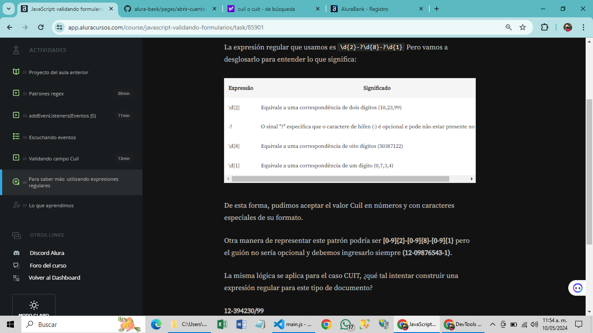

  

  

Formulario de creación de cuenta para el banco virtual AluraBank.

## Tecnologías utilizadas durante el curso
* JavaScript

## Tecnologías utilizadas en el proyecto
* HTML
* CSS

pattners:

Cuando trabajamos en el registro de una persona o empresa en una aplicación bancaria como Alura-Bank necesitamos validar su código de identificación laboral o tributaria. Cada país tiene una fórmula específica para generar este código.

Tomaremos como ejemplo el Cuil (Código Único de identificación Laboral) o Cuit (Código Unico de Identificación Tributaria).

CUIL / CUIT

CUIL/T: Son 11 números en total:
XY – 12345678 – Z
XY: Indican el tipo (Masculino, Femenino o una empresa)
12345678: Número de DNI
Z: Código Verificador
Algoritmo:

Se determina XY con las siguientes reglas
Masculino: 20
Femenio: 27
Empresa: 30
Se multiplica XY 12345678 por un número de forma separada:

Se suman dichos resultados. El resultado obtenido se divide por 11. De esa división se obtiene un Resto que determina Z.

Si el resto es 0 = Entonces Z=0 Si el resto es 1= Entonces se aplica la siguiente regla:

Si es hombre: Z=9 y XY pasa a ser 23
Si es mujer: Z=4 y XY pasa a ser 23
Caso contrario XY pasa a ser (11- Resto).

148/11=13,4545—>13 (Redondeo)

Obtenemos el resto de la división

148 – (13*11)=5

Determinamos Z

11-5 = 6

El resultado final sería 20-12345678-6

Lo que aprendi este módulo 3 del cursp de válidar formulario de una aplicación bancaria

Valide los dígitos de control de Cuil/Cuit;
Transforme fórmulas matemáticas en código;
Tratar con fechas en JavaScript;
Construya comparaciones de fechas para verificar la edad.

En el módulo 4 vimso validity y sus propiedades 
const tipoErrores = [
  "valueMissing",
  "typeMissmatch",
  "patternMissmatch",
  "tooShort",
  "customError",
];

Almacenamiento:
localStorage.setItem('usuario',JSON.stringify(usuario));
El método setItem() permite almacenar objetos en el localStorage y a través del método JSON.stringify() convertimos el objeto a un formato compatible para su almacenamiento.
localStorage.setItem("nombreLlave",JSON.stringify(json));

Para almacenar los datos del formulario, se utilizó localStorage. El objeto localStorage permite guardar pares clave/valor en el navegador sin fecha de caducidad, es decir, los datos no se borran cuando se cierra el navegador y quedan disponibles para futuras navegaciones.

Para verificar su almacenamiento puede dirigirte a la DevTools -> Aplicación -> Almacenamiento -> IP

Encontrar validaciones predeterminadas que existen en JavaScript con el estado de validez;
Interpretar cada tipo de error;
Crear mensajes personalizados;
Eliminar el comportamiento de error de HTML predeterminado;
Mostrar mensajes personalizados en la página;
Guardar datos en localStorage.

## 1 Inicia la camara, 2 toma foto y 3 guardala
__1__
debe de estár dentro de una función async.

const iniciarVideo = await navigator.mediaDevices.getUserMedia({video:true,audio:false});
video.srcObject=iniciarVideo;
__2__

__3__